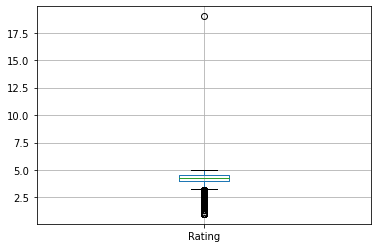
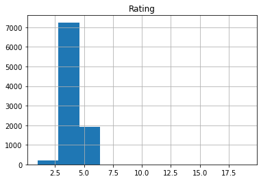
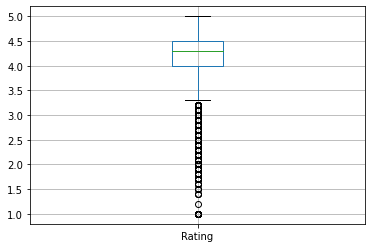
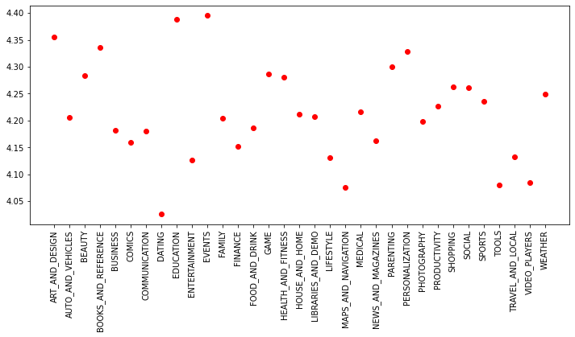
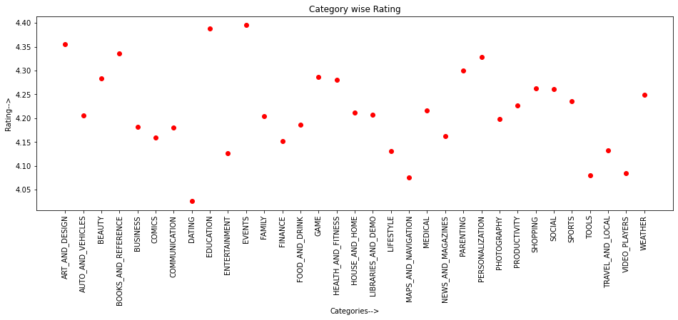
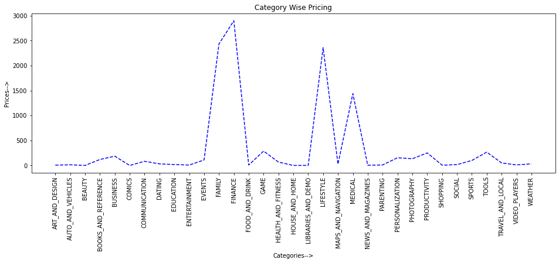
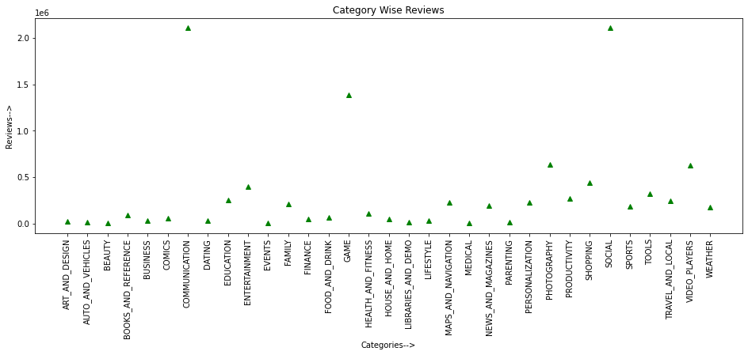

# Data Analysis of Google Apps Rating

### Import the required Modules


```python
import numpy as np
import pandas as pd
import seaborn as sns
import matplotlib.pyplot as plt
```


```python
# for printing graphs

%matplotlib inline
```

## Read Data from the Excel file

### Please ensure that your folder name **does not have a space or a forward slash(/)**


```python
google_data = pd.read_csv('F:\Data Science Learning Notes\GoogleAppRating Analysis\googleplaystore.csv')
```


```python
type(google_data)
```


    pandas.core.frame.DataFrame


```python
google_data.head(5)
```


<div>
<style scoped>
    .dataframe tbody tr th:only-of-type {
        vertical-align: middle;
    }

    .dataframe tbody tr th {
        vertical-align: top;
    }

    .dataframe thead th {
        text-align: right;
    }
</style>
<table border="1" class="dataframe">
  <thead>
    <tr style="text-align: right;">
      <th></th>
      <th>App</th>
      <th>Category</th>
      <th>Rating</th>
      <th>Reviews</th>
      <th>Size</th>
      <th>Installs</th>
      <th>Type</th>
      <th>Price</th>
      <th>Content Rating</th>
      <th>Genres</th>
      <th>Last Updated</th>
      <th>Current Ver</th>
      <th>Android Ver</th>
    </tr>
  </thead>
  <tbody>
    <tr>
      <th>0</th>
      <td>Photo Editor &amp; Candy Camera &amp; Grid &amp; ScrapBook</td>
      <td>ART_AND_DESIGN</td>
      <td>4.1</td>
      <td>159</td>
      <td>19M</td>
      <td>10,000+</td>
      <td>Free</td>
      <td>0</td>
      <td>Everyone</td>
      <td>Art &amp; Design</td>
      <td>January 7, 2018</td>
      <td>1.0.0</td>
      <td>4.0.3 and up</td>
    </tr>
    <tr>
      <th>1</th>
      <td>Coloring book moana</td>
      <td>ART_AND_DESIGN</td>
      <td>3.9</td>
      <td>967</td>
      <td>14M</td>
      <td>500,000+</td>
      <td>Free</td>
      <td>0</td>
      <td>Everyone</td>
      <td>Art &amp; Design;Pretend Play</td>
      <td>January 15, 2018</td>
      <td>2.0.0</td>
      <td>4.0.3 and up</td>
    </tr>
    <tr>
      <th>2</th>
      <td>U Launcher Lite – FREE Live Cool Themes, Hide ...</td>
      <td>ART_AND_DESIGN</td>
      <td>4.7</td>
      <td>87510</td>
      <td>8.7M</td>
      <td>5,000,000+</td>
      <td>Free</td>
      <td>0</td>
      <td>Everyone</td>
      <td>Art &amp; Design</td>
      <td>August 1, 2018</td>
      <td>1.2.4</td>
      <td>4.0.3 and up</td>
    </tr>
    <tr>
      <th>3</th>
      <td>Sketch - Draw &amp; Paint</td>
      <td>ART_AND_DESIGN</td>
      <td>4.5</td>
      <td>215644</td>
      <td>25M</td>
      <td>50,000,000+</td>
      <td>Free</td>
      <td>0</td>
      <td>Teen</td>
      <td>Art &amp; Design</td>
      <td>June 8, 2018</td>
      <td>Varies with device</td>
      <td>4.2 and up</td>
    </tr>
    <tr>
      <th>4</th>
      <td>Pixel Draw - Number Art Coloring Book</td>
      <td>ART_AND_DESIGN</td>
      <td>4.3</td>
      <td>967</td>
      <td>2.8M</td>
      <td>100,000+</td>
      <td>Free</td>
      <td>0</td>
      <td>Everyone</td>
      <td>Art &amp; Design;Creativity</td>
      <td>June 20, 2018</td>
      <td>1.1</td>
      <td>4.4 and up</td>
    </tr>
  </tbody>
</table>
</div>


```python
google_data.tail(10)
```


<div>
<style scoped>
    .dataframe tbody tr th:only-of-type {
        vertical-align: middle;
    }

    .dataframe tbody tr th {
        vertical-align: top;
    }

    .dataframe thead th {
        text-align: right;
    }
</style>
<table border="1" class="dataframe">
  <thead>
    <tr style="text-align: right;">
      <th></th>
      <th>App</th>
      <th>Category</th>
      <th>Rating</th>
      <th>Reviews</th>
      <th>Size</th>
      <th>Installs</th>
      <th>Type</th>
      <th>Price</th>
      <th>Content Rating</th>
      <th>Genres</th>
      <th>Last Updated</th>
      <th>Current Ver</th>
      <th>Android Ver</th>
    </tr>
  </thead>
  <tbody>
    <tr>
      <th>10831</th>
      <td>payermonstationnement.fr</td>
      <td>MAPS_AND_NAVIGATION</td>
      <td>NaN</td>
      <td>38</td>
      <td>9.8M</td>
      <td>5,000+</td>
      <td>Free</td>
      <td>0</td>
      <td>Everyone</td>
      <td>Maps &amp; Navigation</td>
      <td>June 13, 2018</td>
      <td>2.0.148.0</td>
      <td>4.0 and up</td>
    </tr>
    <tr>
      <th>10832</th>
      <td>FR Tides</td>
      <td>WEATHER</td>
      <td>3.8</td>
      <td>1195</td>
      <td>582k</td>
      <td>100,000+</td>
      <td>Free</td>
      <td>0</td>
      <td>Everyone</td>
      <td>Weather</td>
      <td>February 16, 2014</td>
      <td>6</td>
      <td>2.1 and up</td>
    </tr>
    <tr>
      <th>10833</th>
      <td>Chemin (fr)</td>
      <td>BOOKS_AND_REFERENCE</td>
      <td>4.8</td>
      <td>44</td>
      <td>619k</td>
      <td>1,000+</td>
      <td>Free</td>
      <td>0</td>
      <td>Everyone</td>
      <td>Books &amp; Reference</td>
      <td>March 23, 2014</td>
      <td>0.8</td>
      <td>2.2 and up</td>
    </tr>
    <tr>
      <th>10834</th>
      <td>FR Calculator</td>
      <td>FAMILY</td>
      <td>4.0</td>
      <td>7</td>
      <td>2.6M</td>
      <td>500+</td>
      <td>Free</td>
      <td>0</td>
      <td>Everyone</td>
      <td>Education</td>
      <td>June 18, 2017</td>
      <td>1.0.0</td>
      <td>4.1 and up</td>
    </tr>
    <tr>
      <th>10835</th>
      <td>FR Forms</td>
      <td>BUSINESS</td>
      <td>NaN</td>
      <td>0</td>
      <td>9.6M</td>
      <td>10+</td>
      <td>Free</td>
      <td>0</td>
      <td>Everyone</td>
      <td>Business</td>
      <td>September 29, 2016</td>
      <td>1.1.5</td>
      <td>4.0 and up</td>
    </tr>
    <tr>
      <th>10836</th>
      <td>Sya9a Maroc - FR</td>
      <td>FAMILY</td>
      <td>4.5</td>
      <td>38</td>
      <td>53M</td>
      <td>5,000+</td>
      <td>Free</td>
      <td>0</td>
      <td>Everyone</td>
      <td>Education</td>
      <td>July 25, 2017</td>
      <td>1.48</td>
      <td>4.1 and up</td>
    </tr>
    <tr>
      <th>10837</th>
      <td>Fr. Mike Schmitz Audio Teachings</td>
      <td>FAMILY</td>
      <td>5.0</td>
      <td>4</td>
      <td>3.6M</td>
      <td>100+</td>
      <td>Free</td>
      <td>0</td>
      <td>Everyone</td>
      <td>Education</td>
      <td>July 6, 2018</td>
      <td>1</td>
      <td>4.1 and up</td>
    </tr>
    <tr>
      <th>10838</th>
      <td>Parkinson Exercices FR</td>
      <td>MEDICAL</td>
      <td>NaN</td>
      <td>3</td>
      <td>9.5M</td>
      <td>1,000+</td>
      <td>Free</td>
      <td>0</td>
      <td>Everyone</td>
      <td>Medical</td>
      <td>January 20, 2017</td>
      <td>1</td>
      <td>2.2 and up</td>
    </tr>
    <tr>
      <th>10839</th>
      <td>The SCP Foundation DB fr nn5n</td>
      <td>BOOKS_AND_REFERENCE</td>
      <td>4.5</td>
      <td>114</td>
      <td>Varies with device</td>
      <td>1,000+</td>
      <td>Free</td>
      <td>0</td>
      <td>Mature 17+</td>
      <td>Books &amp; Reference</td>
      <td>January 19, 2015</td>
      <td>Varies with device</td>
      <td>Varies with device</td>
    </tr>
    <tr>
      <th>10840</th>
      <td>iHoroscope - 2018 Daily Horoscope &amp; Astrology</td>
      <td>LIFESTYLE</td>
      <td>4.5</td>
      <td>398307</td>
      <td>19M</td>
      <td>10,000,000+</td>
      <td>Free</td>
      <td>0</td>
      <td>Everyone</td>
      <td>Lifestyle</td>
      <td>July 25, 2018</td>
      <td>Varies with device</td>
      <td>Varies with device</td>
    </tr>
  </tbody>
</table>
</div>


```python
google_data.shape
```


    (10841, 13)


```python
google_data.describe() # Statistics
```


<div>
<style scoped>
    .dataframe tbody tr th:only-of-type {
        vertical-align: middle;
    }

    .dataframe tbody tr th {
        vertical-align: top;
    }

    .dataframe thead th {
        text-align: right;
    }
</style>
<table border="1" class="dataframe">
  <thead>
    <tr style="text-align: right;">
      <th></th>
      <th>Rating</th>
    </tr>
  </thead>
  <tbody>
    <tr>
      <th>count</th>
      <td>9367.000000</td>
    </tr>
    <tr>
      <th>mean</th>
      <td>4.193338</td>
    </tr>
    <tr>
      <th>std</th>
      <td>0.537431</td>
    </tr>
    <tr>
      <th>min</th>
      <td>1.000000</td>
    </tr>
    <tr>
      <th>25%</th>
      <td>4.000000</td>
    </tr>
    <tr>
      <th>50%</th>
      <td>4.300000</td>
    </tr>
    <tr>
      <th>75%</th>
      <td>4.500000</td>
    </tr>
    <tr>
      <th>max</th>
      <td>19.000000</td>
    </tr>
  </tbody>
</table>
</div>


```python
google_data.boxplot()
```


    <matplotlib.axes._subplots.AxesSubplot at 0x1d08a92a588>





```python
google_data.hist()
```


    array([[<matplotlib.axes._subplots.AxesSubplot object at 0x000001D08AB7AD88>]],
          dtype=object)





```python
google_data.info()
```

    <class 'pandas.core.frame.DataFrame'>
    RangeIndex: 10841 entries, 0 to 10840
    Data columns (total 13 columns):
     #   Column          Non-Null Count  Dtype  
    ---  ------          --------------  -----  
     0   App             10841 non-null  object 
     1   Category        10841 non-null  object 
     2   Rating          9367 non-null   float64
     3   Reviews         10841 non-null  object 
     4   Size            10841 non-null  object 
     5   Installs        10841 non-null  object 
     6   Type            10840 non-null  object 
     7   Price           10841 non-null  object 
     8   Content Rating  10840 non-null  object 
     9   Genres          10841 non-null  object 
     10  Last Updated    10841 non-null  object 
     11  Current Ver     10833 non-null  object 
     12  Android Ver     10838 non-null  object 
    dtypes: float64(1), object(12)
    memory usage: 1.1+ MB
    

# Data Cleaning 

## Count the number of missing value in the Data Frame


```python
google_data.isnull()
```


<div>
<style scoped>
    .dataframe tbody tr th:only-of-type {
        vertical-align: middle;
    }

    .dataframe tbody tr th {
        vertical-align: top;
    }

    .dataframe thead th {
        text-align: right;
    }
</style>
<table border="1" class="dataframe">
  <thead>
    <tr style="text-align: right;">
      <th></th>
      <th>App</th>
      <th>Category</th>
      <th>Rating</th>
      <th>Reviews</th>
      <th>Size</th>
      <th>Installs</th>
      <th>Type</th>
      <th>Price</th>
      <th>Content Rating</th>
      <th>Genres</th>
      <th>Last Updated</th>
      <th>Current Ver</th>
      <th>Android Ver</th>
    </tr>
  </thead>
  <tbody>
    <tr>
      <th>0</th>
      <td>False</td>
      <td>False</td>
      <td>False</td>
      <td>False</td>
      <td>False</td>
      <td>False</td>
      <td>False</td>
      <td>False</td>
      <td>False</td>
      <td>False</td>
      <td>False</td>
      <td>False</td>
      <td>False</td>
    </tr>
    <tr>
      <th>1</th>
      <td>False</td>
      <td>False</td>
      <td>False</td>
      <td>False</td>
      <td>False</td>
      <td>False</td>
      <td>False</td>
      <td>False</td>
      <td>False</td>
      <td>False</td>
      <td>False</td>
      <td>False</td>
      <td>False</td>
    </tr>
    <tr>
      <th>2</th>
      <td>False</td>
      <td>False</td>
      <td>False</td>
      <td>False</td>
      <td>False</td>
      <td>False</td>
      <td>False</td>
      <td>False</td>
      <td>False</td>
      <td>False</td>
      <td>False</td>
      <td>False</td>
      <td>False</td>
    </tr>
    <tr>
      <th>3</th>
      <td>False</td>
      <td>False</td>
      <td>False</td>
      <td>False</td>
      <td>False</td>
      <td>False</td>
      <td>False</td>
      <td>False</td>
      <td>False</td>
      <td>False</td>
      <td>False</td>
      <td>False</td>
      <td>False</td>
    </tr>
    <tr>
      <th>4</th>
      <td>False</td>
      <td>False</td>
      <td>False</td>
      <td>False</td>
      <td>False</td>
      <td>False</td>
      <td>False</td>
      <td>False</td>
      <td>False</td>
      <td>False</td>
      <td>False</td>
      <td>False</td>
      <td>False</td>
    </tr>
    <tr>
      <th>...</th>
      <td>...</td>
      <td>...</td>
      <td>...</td>
      <td>...</td>
      <td>...</td>
      <td>...</td>
      <td>...</td>
      <td>...</td>
      <td>...</td>
      <td>...</td>
      <td>...</td>
      <td>...</td>
      <td>...</td>
    </tr>
    <tr>
      <th>10836</th>
      <td>False</td>
      <td>False</td>
      <td>False</td>
      <td>False</td>
      <td>False</td>
      <td>False</td>
      <td>False</td>
      <td>False</td>
      <td>False</td>
      <td>False</td>
      <td>False</td>
      <td>False</td>
      <td>False</td>
    </tr>
    <tr>
      <th>10837</th>
      <td>False</td>
      <td>False</td>
      <td>False</td>
      <td>False</td>
      <td>False</td>
      <td>False</td>
      <td>False</td>
      <td>False</td>
      <td>False</td>
      <td>False</td>
      <td>False</td>
      <td>False</td>
      <td>False</td>
    </tr>
    <tr>
      <th>10838</th>
      <td>False</td>
      <td>False</td>
      <td>True</td>
      <td>False</td>
      <td>False</td>
      <td>False</td>
      <td>False</td>
      <td>False</td>
      <td>False</td>
      <td>False</td>
      <td>False</td>
      <td>False</td>
      <td>False</td>
    </tr>
    <tr>
      <th>10839</th>
      <td>False</td>
      <td>False</td>
      <td>False</td>
      <td>False</td>
      <td>False</td>
      <td>False</td>
      <td>False</td>
      <td>False</td>
      <td>False</td>
      <td>False</td>
      <td>False</td>
      <td>False</td>
      <td>False</td>
    </tr>
    <tr>
      <th>10840</th>
      <td>False</td>
      <td>False</td>
      <td>False</td>
      <td>False</td>
      <td>False</td>
      <td>False</td>
      <td>False</td>
      <td>False</td>
      <td>False</td>
      <td>False</td>
      <td>False</td>
      <td>False</td>
      <td>False</td>
    </tr>
  </tbody>
</table>
<p>10841 rows × 13 columns</p>
</div>


```python
# Count the number of missing value in each column

google_data.isnull().sum()
```


    App                  0
    Category             0
    Rating            1474
    Reviews              0
    Size                 0
    Installs             0
    Type                 1
    Price                0
    Content Rating       1
    Genres               0
    Last Updated         0
    Current Ver          8
    Android Ver          3
    dtype: int64


# Check how many ratings are more than 5 - outliers


```python
google_data[google_data.Rating > 5]
```


<div>
<style scoped>
    .dataframe tbody tr th:only-of-type {
        vertical-align: middle;
    }

    .dataframe tbody tr th {
        vertical-align: top;
    }

    .dataframe thead th {
        text-align: right;
    }
</style>
<table border="1" class="dataframe">
  <thead>
    <tr style="text-align: right;">
      <th></th>
      <th>App</th>
      <th>Category</th>
      <th>Rating</th>
      <th>Reviews</th>
      <th>Size</th>
      <th>Installs</th>
      <th>Type</th>
      <th>Price</th>
      <th>Content Rating</th>
      <th>Genres</th>
      <th>Last Updated</th>
      <th>Current Ver</th>
      <th>Android Ver</th>
    </tr>
  </thead>
  <tbody>
    <tr>
      <th>10472</th>
      <td>Life Made WI-Fi Touchscreen Photo Frame</td>
      <td>1.9</td>
      <td>19.0</td>
      <td>3.0M</td>
      <td>1,000+</td>
      <td>Free</td>
      <td>0</td>
      <td>Everyone</td>
      <td>NaN</td>
      <td>February 11, 2018</td>
      <td>1.0.19</td>
      <td>4.0 and up</td>
      <td>NaN</td>
    </tr>
  </tbody>
</table>
</div>


```python
google_data.drop([10472], inplace=True)
```


```python
google_data[10470 : 10475]
```


<div>
<style scoped>
    .dataframe tbody tr th:only-of-type {
        vertical-align: middle;
    }

    .dataframe tbody tr th {
        vertical-align: top;
    }

    .dataframe thead th {
        text-align: right;
    }
</style>
<table border="1" class="dataframe">
  <thead>
    <tr style="text-align: right;">
      <th></th>
      <th>App</th>
      <th>Category</th>
      <th>Rating</th>
      <th>Reviews</th>
      <th>Size</th>
      <th>Installs</th>
      <th>Type</th>
      <th>Price</th>
      <th>Content Rating</th>
      <th>Genres</th>
      <th>Last Updated</th>
      <th>Current Ver</th>
      <th>Android Ver</th>
    </tr>
  </thead>
  <tbody>
    <tr>
      <th>10470</th>
      <td>Jazz Wi-Fi</td>
      <td>COMMUNICATION</td>
      <td>3.4</td>
      <td>49</td>
      <td>4.0M</td>
      <td>10,000+</td>
      <td>Free</td>
      <td>0</td>
      <td>Everyone</td>
      <td>Communication</td>
      <td>February 10, 2017</td>
      <td>0.1</td>
      <td>2.3 and up</td>
    </tr>
    <tr>
      <th>10471</th>
      <td>Xposed Wi-Fi-Pwd</td>
      <td>PERSONALIZATION</td>
      <td>3.5</td>
      <td>1042</td>
      <td>404k</td>
      <td>100,000+</td>
      <td>Free</td>
      <td>0</td>
      <td>Everyone</td>
      <td>Personalization</td>
      <td>August 5, 2014</td>
      <td>3.0.0</td>
      <td>4.0.3 and up</td>
    </tr>
    <tr>
      <th>10473</th>
      <td>osmino Wi-Fi: free WiFi</td>
      <td>TOOLS</td>
      <td>4.2</td>
      <td>134203</td>
      <td>4.1M</td>
      <td>10,000,000+</td>
      <td>Free</td>
      <td>0</td>
      <td>Everyone</td>
      <td>Tools</td>
      <td>August 7, 2018</td>
      <td>6.06.14</td>
      <td>4.4 and up</td>
    </tr>
    <tr>
      <th>10474</th>
      <td>Sat-Fi Voice</td>
      <td>COMMUNICATION</td>
      <td>3.4</td>
      <td>37</td>
      <td>14M</td>
      <td>1,000+</td>
      <td>Free</td>
      <td>0</td>
      <td>Everyone</td>
      <td>Communication</td>
      <td>November 21, 2014</td>
      <td>2.2.1.5</td>
      <td>2.2 and up</td>
    </tr>
    <tr>
      <th>10475</th>
      <td>Wi-Fi Visualizer</td>
      <td>TOOLS</td>
      <td>3.9</td>
      <td>132</td>
      <td>2.6M</td>
      <td>50,000+</td>
      <td>Free</td>
      <td>0</td>
      <td>Everyone</td>
      <td>Tools</td>
      <td>May 17, 2017</td>
      <td>0.0.9</td>
      <td>2.3 and up</td>
    </tr>
  </tbody>
</table>
</div>


```python
google_data.boxplot()
```


    <matplotlib.axes._subplots.AxesSubplot at 0x1d08b84fe48>





```python
google_data.hist()
```


    array([[<matplotlib.axes._subplots.AxesSubplot object at 0x000001D08B82C6C8>]],
          dtype=object)


# Remove columns that are 90% empty


```python
threshold = len(google_data) * 0.1 # 10% of (my rows = 10840)
```


```python
threshold
```


    1084.0


```python
google_data.dropna(thresh=threshold, axis = 1, inplace=True)
```


```python
google_data.isnull().sum()
```


    App                  0
    Category             0
    Rating            1474
    Reviews              0
    Size                 0
    Installs             0
    Type                 1
    Price                0
    Content Rating       0
    Genres               0
    Last Updated         0
    Current Ver          8
    Android Ver          2
    dtype: int64


```python
google_data.shape
```


    (10840, 13)


# Data Manipulations

Fill the null values with appropriate values using aggregate functions such as mean, median and mode.


```python
# Define a function impute_median

def impute_median(series):
    return series.fillna(series.median())
```


```python
google_data.Rating = google_data['Rating'].transform(impute_median)
```


```python
#Count the number of null values in each column

google_data.isnull().sum()
```


    App               0
    Category          0
    Rating            0
    Reviews           0
    Size              0
    Installs          0
    Type              1
    Price             0
    Content Rating    0
    Genres            0
    Last Updated      0
    Current Ver       8
    Android Ver       2
    dtype: int64


```python
# modes of categorial values

print(google_data['Type'].mode())
```

    0    Free
    dtype: object
    


```python
google_data['Current Ver'].mode()
```


    0    Varies with device
    dtype: object


```python
google_data['Android Ver'].mode()
```


    0    4.1 and up
    dtype: object


```python
# Fill missing categorial values with mode

google_data['Type'].fillna(str(google_data['Type'].mode().values[0]), inplace=True)
```


```python
google_data.isnull().sum()
```


    App               0
    Category          0
    Rating            0
    Reviews           0
    Size              0
    Installs          0
    Type              0
    Price             0
    Content Rating    0
    Genres            0
    Last Updated      0
    Current Ver       8
    Android Ver       2
    dtype: int64


```python
google_data['Current Ver'].fillna(str(google_data['Current Ver'].mode().values[0]), inplace=True)
```


```python
google_data['Android Ver'].fillna(str(google_data['Android Ver'].mode().values[0]), inplace=True)
```


```python
# count the number of null values in each column

google_data.isnull().sum()
```


    App               0
    Category          0
    Rating            0
    Reviews           0
    Size              0
    Installs          0
    Type              0
    Price             0
    Content Rating    0
    Genres            0
    Last Updated      0
    Current Ver       0
    Android Ver       0
    dtype: int64


```python
# Let's convert Price, Reviews and Ratings into Numerical values

google_data['Price'] = google_data['Price'].apply(lambda x: str(x).replace('$', '') if '$' in str(x) else str(x))
```


```python
google_data['Price'] = google_data['Price'].apply(lambda x: float(x))
```


```python
google_data['Reviews'] = pd.to_numeric(google_data['Reviews'], errors='coerce')
```


```python
google_data['Installs'] = google_data['Installs'].apply(lambda x: str(x).replace('+', '') if '+' in str(x) else str(x))
```


```python
google_data['Installs'] = google_data['Installs'].apply(lambda x: str(x).replace(',', '') if ',' in str(x) else str(x))
```


```python
google_data['Installs'] = google_data['Installs'].apply(lambda x: float(x))
```


```python
google_data.head(10)
```


<div>
<style scoped>
    .dataframe tbody tr th:only-of-type {
        vertical-align: middle;
    }

    .dataframe tbody tr th {
        vertical-align: top;
    }

    .dataframe thead th {
        text-align: right;
    }
</style>
<table border="1" class="dataframe">
  <thead>
    <tr style="text-align: right;">
      <th></th>
      <th>App</th>
      <th>Category</th>
      <th>Rating</th>
      <th>Reviews</th>
      <th>Size</th>
      <th>Installs</th>
      <th>Type</th>
      <th>Price</th>
      <th>Content Rating</th>
      <th>Genres</th>
      <th>Last Updated</th>
      <th>Current Ver</th>
      <th>Android Ver</th>
    </tr>
  </thead>
  <tbody>
    <tr>
      <th>0</th>
      <td>Photo Editor &amp; Candy Camera &amp; Grid &amp; ScrapBook</td>
      <td>ART_AND_DESIGN</td>
      <td>4.1</td>
      <td>159</td>
      <td>19M</td>
      <td>10000.0</td>
      <td>Free</td>
      <td>0.0</td>
      <td>Everyone</td>
      <td>Art &amp; Design</td>
      <td>January 7, 2018</td>
      <td>1.0.0</td>
      <td>4.0.3 and up</td>
    </tr>
    <tr>
      <th>1</th>
      <td>Coloring book moana</td>
      <td>ART_AND_DESIGN</td>
      <td>3.9</td>
      <td>967</td>
      <td>14M</td>
      <td>500000.0</td>
      <td>Free</td>
      <td>0.0</td>
      <td>Everyone</td>
      <td>Art &amp; Design;Pretend Play</td>
      <td>January 15, 2018</td>
      <td>2.0.0</td>
      <td>4.0.3 and up</td>
    </tr>
    <tr>
      <th>2</th>
      <td>U Launcher Lite – FREE Live Cool Themes, Hide ...</td>
      <td>ART_AND_DESIGN</td>
      <td>4.7</td>
      <td>87510</td>
      <td>8.7M</td>
      <td>5000000.0</td>
      <td>Free</td>
      <td>0.0</td>
      <td>Everyone</td>
      <td>Art &amp; Design</td>
      <td>August 1, 2018</td>
      <td>1.2.4</td>
      <td>4.0.3 and up</td>
    </tr>
    <tr>
      <th>3</th>
      <td>Sketch - Draw &amp; Paint</td>
      <td>ART_AND_DESIGN</td>
      <td>4.5</td>
      <td>215644</td>
      <td>25M</td>
      <td>50000000.0</td>
      <td>Free</td>
      <td>0.0</td>
      <td>Teen</td>
      <td>Art &amp; Design</td>
      <td>June 8, 2018</td>
      <td>Varies with device</td>
      <td>4.2 and up</td>
    </tr>
    <tr>
      <th>4</th>
      <td>Pixel Draw - Number Art Coloring Book</td>
      <td>ART_AND_DESIGN</td>
      <td>4.3</td>
      <td>967</td>
      <td>2.8M</td>
      <td>100000.0</td>
      <td>Free</td>
      <td>0.0</td>
      <td>Everyone</td>
      <td>Art &amp; Design;Creativity</td>
      <td>June 20, 2018</td>
      <td>1.1</td>
      <td>4.4 and up</td>
    </tr>
    <tr>
      <th>5</th>
      <td>Paper flowers instructions</td>
      <td>ART_AND_DESIGN</td>
      <td>4.4</td>
      <td>167</td>
      <td>5.6M</td>
      <td>50000.0</td>
      <td>Free</td>
      <td>0.0</td>
      <td>Everyone</td>
      <td>Art &amp; Design</td>
      <td>March 26, 2017</td>
      <td>1</td>
      <td>2.3 and up</td>
    </tr>
    <tr>
      <th>6</th>
      <td>Smoke Effect Photo Maker - Smoke Editor</td>
      <td>ART_AND_DESIGN</td>
      <td>3.8</td>
      <td>178</td>
      <td>19M</td>
      <td>50000.0</td>
      <td>Free</td>
      <td>0.0</td>
      <td>Everyone</td>
      <td>Art &amp; Design</td>
      <td>April 26, 2018</td>
      <td>1.1</td>
      <td>4.0.3 and up</td>
    </tr>
    <tr>
      <th>7</th>
      <td>Infinite Painter</td>
      <td>ART_AND_DESIGN</td>
      <td>4.1</td>
      <td>36815</td>
      <td>29M</td>
      <td>1000000.0</td>
      <td>Free</td>
      <td>0.0</td>
      <td>Everyone</td>
      <td>Art &amp; Design</td>
      <td>June 14, 2018</td>
      <td>6.1.61.1</td>
      <td>4.2 and up</td>
    </tr>
    <tr>
      <th>8</th>
      <td>Garden Coloring Book</td>
      <td>ART_AND_DESIGN</td>
      <td>4.4</td>
      <td>13791</td>
      <td>33M</td>
      <td>1000000.0</td>
      <td>Free</td>
      <td>0.0</td>
      <td>Everyone</td>
      <td>Art &amp; Design</td>
      <td>September 20, 2017</td>
      <td>2.9.2</td>
      <td>3.0 and up</td>
    </tr>
    <tr>
      <th>9</th>
      <td>Kids Paint Free - Drawing Fun</td>
      <td>ART_AND_DESIGN</td>
      <td>4.7</td>
      <td>121</td>
      <td>3.1M</td>
      <td>10000.0</td>
      <td>Free</td>
      <td>0.0</td>
      <td>Everyone</td>
      <td>Art &amp; Design;Creativity</td>
      <td>July 3, 2018</td>
      <td>2.8</td>
      <td>4.0.3 and up</td>
    </tr>
  </tbody>
</table>
</div>


```python
google_data.describe()
```


<div>
<style scoped>
    .dataframe tbody tr th:only-of-type {
        vertical-align: middle;
    }

    .dataframe tbody tr th {
        vertical-align: top;
    }

    .dataframe thead th {
        text-align: right;
    }
</style>
<table border="1" class="dataframe">
  <thead>
    <tr style="text-align: right;">
      <th></th>
      <th>Rating</th>
      <th>Reviews</th>
      <th>Installs</th>
      <th>Price</th>
    </tr>
  </thead>
  <tbody>
    <tr>
      <th>count</th>
      <td>10840.000000</td>
      <td>1.084000e+04</td>
      <td>1.084000e+04</td>
      <td>10840.000000</td>
    </tr>
    <tr>
      <th>mean</th>
      <td>4.206476</td>
      <td>4.441529e+05</td>
      <td>1.546434e+07</td>
      <td>1.027368</td>
    </tr>
    <tr>
      <th>std</th>
      <td>0.480342</td>
      <td>2.927761e+06</td>
      <td>8.502936e+07</td>
      <td>15.949703</td>
    </tr>
    <tr>
      <th>min</th>
      <td>1.000000</td>
      <td>0.000000e+00</td>
      <td>0.000000e+00</td>
      <td>0.000000</td>
    </tr>
    <tr>
      <th>25%</th>
      <td>4.100000</td>
      <td>3.800000e+01</td>
      <td>1.000000e+03</td>
      <td>0.000000</td>
    </tr>
    <tr>
      <th>50%</th>
      <td>4.300000</td>
      <td>2.094000e+03</td>
      <td>1.000000e+05</td>
      <td>0.000000</td>
    </tr>
    <tr>
      <th>75%</th>
      <td>4.500000</td>
      <td>5.477550e+04</td>
      <td>5.000000e+06</td>
      <td>0.000000</td>
    </tr>
    <tr>
      <th>max</th>
      <td>5.000000</td>
      <td>7.815831e+07</td>
      <td>1.000000e+09</td>
      <td>400.000000</td>
    </tr>
  </tbody>
</table>
</div>


# Data Visualization


```python
grp = google_data.groupby('Category')
```


```python
x = grp['Rating'].agg(np.mean)
```


```python
y = grp['Price'].agg(np.sum)
```


```python
z = grp['Reviews'].agg(np.mean)
```


```python
x
```


    Category
    ART_AND_DESIGN         4.355385
    AUTO_AND_VEHICLES      4.205882
    BEAUTY                 4.283019
    BOOKS_AND_REFERENCE    4.335498
    BUSINESS               4.182391
    COMICS                 4.160000
    COMMUNICATION          4.180103
    DATING                 4.025641
    EDUCATION              4.388462
    ENTERTAINMENT          4.126174
    EVENTS                 4.395313
    FAMILY                 4.204564
    FINANCE                4.151639
    FOOD_AND_DRINK         4.185827
    GAME                   4.286888
    HEALTH_AND_FITNESS     4.280059
    HOUSE_AND_HOME         4.211364
    LIBRARIES_AND_DEMO     4.207059
    LIFESTYLE              4.131414
    MAPS_AND_NAVIGATION    4.075182
    MEDICAL                4.216199
    NEWS_AND_MAGAZINES     4.161837
    PARENTING              4.300000
    PERSONALIZATION        4.328827
    PHOTOGRAPHY            4.197910
    PRODUCTIVITY           4.226651
    SHOPPING               4.263077
    SOCIAL                 4.261017
    SPORTS                 4.236458
    TOOLS                  4.080071
    TRAVEL_AND_LOCAL       4.132946
    VIDEO_PLAYERS          4.084000
    WEATHER                4.248780
    Name: Rating, dtype: float64


```python
y
```


    Category
    ART_AND_DESIGN            5.97
    AUTO_AND_VEHICLES        13.47
    BEAUTY                    0.00
    BOOKS_AND_REFERENCE     119.77
    BUSINESS                185.27
    COMICS                    0.00
    COMMUNICATION            83.14
    DATING                   31.43
    EDUCATION                17.96
    ENTERTAINMENT             7.98
    EVENTS                  109.99
    FAMILY                 2434.78
    FINANCE                2900.83
    FOOD_AND_DRINK            8.48
    GAME                    287.30
    HEALTH_AND_FITNESS       67.34
    HOUSE_AND_HOME            0.00
    LIBRARIES_AND_DEMO        0.99
    LIFESTYLE              2360.87
    MAPS_AND_NAVIGATION      26.95
    MEDICAL                1439.96
    NEWS_AND_MAGAZINES        3.98
    PARENTING                 9.58
    PERSONALIZATION         153.96
    PHOTOGRAPHY             134.21
    PRODUCTIVITY            250.93
    SHOPPING                  5.48
    SOCIAL                   15.97
    SPORTS                  100.00
    TOOLS                   267.25
    TRAVEL_AND_LOCAL         49.95
    VIDEO_PLAYERS            10.46
    WEATHER                  32.42
    Name: Price, dtype: float64


```python
z
```


    Category
    ART_AND_DESIGN         2.637600e+04
    AUTO_AND_VEHICLES      1.369019e+04
    BEAUTY                 7.476226e+03
    BOOKS_AND_REFERENCE    9.506090e+04
    BUSINESS               3.033598e+04
    COMICS                 5.638793e+04
    COMMUNICATION          2.107138e+06
    DATING                 3.115931e+04
    EDUCATION              2.538191e+05
    ENTERTAINMENT          3.971688e+05
    EVENTS                 2.515906e+03
    FAMILY                 2.080255e+05
    FINANCE                4.795281e+04
    FOOD_AND_DRINK         6.994748e+04
    GAME                   1.385859e+06
    HEALTH_AND_FITNESS     1.111253e+05
    HOUSE_AND_HOME         4.518619e+04
    LIBRARIES_AND_DEMO     1.220139e+04
    LIFESTYLE              3.372457e+04
    MAPS_AND_NAVIGATION    2.237902e+05
    MEDICAL                3.425432e+03
    NEWS_AND_MAGAZINES     1.922292e+05
    PARENTING              1.597218e+04
    PERSONALIZATION        2.279238e+05
    PHOTOGRAPHY            6.373631e+05
    PRODUCTIVITY           2.691438e+05
    SHOPPING               4.424662e+05
    SOCIAL                 2.105903e+06
    SPORTS                 1.844536e+05
    TOOLS                  3.240629e+05
    TRAVEL_AND_LOCAL       2.427051e+05
    VIDEO_PLAYERS          6.307439e+05
    WEATHER                1.781065e+05
    Name: Reviews, dtype: float64


```python
plt.figure(figsize=(12, 5))
plt.plot(x, 'ro')
plt.xticks(rotation = 90)
plt.show()
```





```python
plt.figure(figsize=(16, 5))
plt.plot(x, 'ro', color='r')
plt.xticks(rotation=90)
plt.title('Category wise Rating')
plt.xlabel('Categories-->')
plt.ylabel('Rating-->')
plt.show()
```





```python
plt.figure(figsize=(16, 5))
plt.plot(y, 'r--', color='b')
plt.xticks(rotation = 90)
plt.title("Category Wise Pricing")
plt.xlabel("Categories-->")
plt.ylabel('Prices-->')
plt.show()
```





```python
plt.figure(figsize=(16, 5))
plt.plot(z, 'g^', color='g')
plt.xticks(rotation = 90)
plt.title("Category Wise Reviews")
plt.xlabel('Categories-->')
plt.ylabel('Reviews-->')
plt.show()
```




